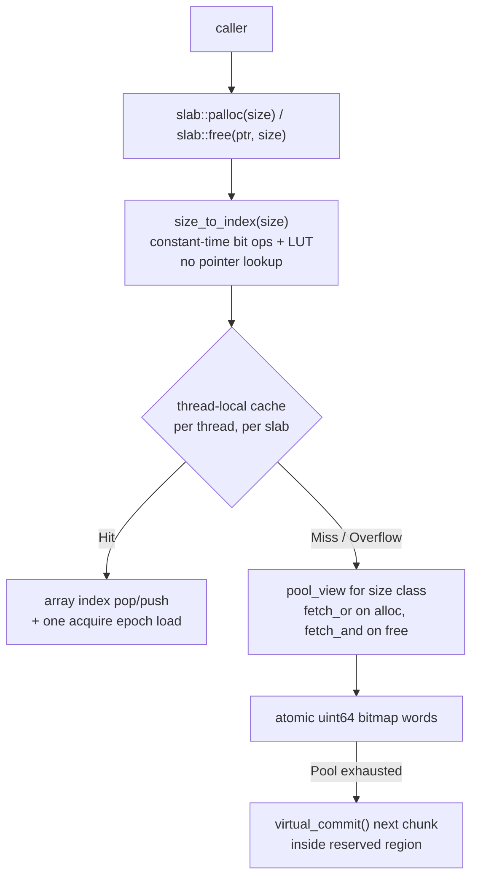

# Palloc

A C++20 memory allocator library built around the insight that the caller usually knows the allocation size. Trading API generality for a consistent speedup over jemalloc on small fixed-size workloads.

`C++20` · `CMake` · `Catch2 v3` · `TSan` · `ASan` · `Linux` · `macOS` · `Windows` · `GCC` · `Clang`

---

## Highlights

- **~1.7x faster than jemalloc** on single-threaded alloc+free across 8B–1024B size classes (14.7–14.9 cycles/op vs 25.0–26.5, RDTSC-measured).
- **Contention-resistant under 16 threads** via a lock-free thread-local cache backed by a lock-free atomic-bitmap pool. Slab degrades to 2.14x single-thread at 16 threads; jemalloc degrades to 2.46x.
- **Mutex-free alloc and free on all non-deprecated paths.** TLC hits are a plain array index op plus one acquire epoch load. TLC misses fall through to `fetch_or` on bitmap words (alloc) or `fetch_and` (free). Pool growth calls the OS to commit pages.
- **Zero data races, zero memory errors** across 153 test cases (235K+ assertions) under both ThreadSanitizer and AddressSanitizer.
- **No system heap dependency** for any non-deprecated allocator. Memory is sourced directly from the OS (`mmap` on Linux/macOS, `VirtualAlloc` on Windows).
- **Single-threaded build mode** (`PALLOC_SINGLE_THREADED`) eliminates every `LOCK`-prefixed instruction by replacing atomics with plain values, giving a 9x speedup on Arena alloc and a 3.1x speedup on Pool alloc+free vs the default threaded build.

---

## At a Glance

| Allocator | Strategy | Thread Safety | Capacity |
|-----------|----------|---------------|----------|
| `arena<>` | Bump pointer | Atomic `fetch_add` (or plain add in `PALLOC_SINGLE_THREADED`) | Fixed (fully committed at construction) |
| `pool_view` | Non-owning bitmap allocator primitive | `fetch_or` on alloc, `fetch_and` on free | Determined by owner |
| `pool` | Bitmap allocator (via `pool_view`) | `fetch_or` on alloc, `fetch_and` on free | Fixed |
| `slab<Config>` / `default_slab` | Multi-pool + thread-local cache | Lock-free TLC, lock-free pool fallback | Grows on demand |

> **Note on `dynamic_slab`**: previously a separate allocator, superseded by `slab` which grows on demand. The header still exists as a tombstone — the class is marked `[[deprecated]]` and contains a `static_assert` that makes instantiation a hard compile error. There is no live implementation.

> **Note on `pool_view`**: has two operational modes. When used standalone (via `pool`), the bitmap is embedded at the start of the same `mmap`'d region as the payload — `pool_view` owns the layout within that region but not the memory itself. When used by `slab`, the bitmap is allocated separately by `slab` and passed in; the payload region is a sub-range of `slab`'s single virtual reservation. In both modes `pool_view` does not own the underlying memory.

> **Note on `pool`**: `pool::init` rounds `block_size` up to the next power of two via `std::bit_ceil`. Passing a non-power-of-two block size is valid but the effective block size will be larger than requested.

---

## Quick Example

```cpp
#include <palloc/slab.h>
#include <palloc/arena.h>

int main() {
    // Slab: multi-size-class with thread-local cache.
    AL::default_slab slab;
    auto* order = static_cast<Order*>(slab.palloc(sizeof(Order)));
    new (order) Order{...};
    slab.free(order, sizeof(Order));   // size required: enables O(1) pool routing

    // Arena: linear bump allocator, freed all at once.
    AL::arena<> arena(64 * 1024);
    void* buf = arena.alloc(128);
    arena.reset();   // resets bump pointer to 0; memory stays mapped
}
```

STL-compatible adapters (`AL::slab_allocator<T>`, `AL::arena_allocator<T>`, `AL::pool_allocator<T>`) are available in `<palloc/allocator.h>` for use with `std::vector`, `std::list`, etc.

### Custom `slab_config`

`default_slab` covers 8B-4096B in 10 power-of-two classes. To tune size classes, block counts, or TLC batch sizes, instantiate `slab_config` directly:

```cpp
#include <palloc/slab_config.h>
#include <palloc/slab.h>

// 3 size classes: 64B, 128B, 256B.
// Constraints: byte_size must be a power of two, strictly increasing,
// batch_size <= num_blocks.
using my_config = AL::slab_config<
    3,                                       // number of size classes
    std::array<AL::size_class, 3>{{
        {.byte_size =  64, .num_blocks = 1024, .batch_size = 64},
        {.byte_size = 128, .num_blocks =  512, .batch_size = 32},
        {.byte_size = 256, .num_blocks =  256, .batch_size = 16},
    }},
    3,               // num_cached_classes: all 3 classes get a TLC
    AL::ONE_GB * 10, // virtual address space reserved at construction (default is AL::ONE_GB * 100)
    4                // max slabs cached per thread
>;

AL::slab<my_config> slab;
void* p = slab.palloc(64);
slab.free(p, 64);
```

The config is validated at compile time. Non-power-of-two sizes, out-of-order classes, or `batch_size > num_blocks` are `static_assert` errors.

---

## Architecture



The default config covers 8B-4096B in 10 power-of-two size classes. Each `slab` reserves up to 100GB(configurable) of *virtual* address space at construction, then commits physical pages on demand as pools fill up.

---

## Engineering Decisions

**1. `slab::free(ptr, size)` requires the caller to pass the size.**
This is the biggest API tradeoff in the library. The caller almost always knows the size (it's `sizeof(T)` for typed allocations, or tracked alongside the pointer in containers). Asking for it makes `free` resolve the owning pool via a constant-time bit operation and LUT lookup (`size_to_index`: two `std::bit_width` calls + compile-time table, no pointer provenance lookup). jemalloc's `free(ptr)` must walk a radix tree keyed on address ranges to find the owning arena and size class, which costs 2-3 cache misses on a cold path. This is the primary source of Slab's edge over jemalloc, and the primary reason Slab cannot be a drop-in heap replacement.

**2. Fully lock-free hot path *and* fallback.**
The thread-local cache is the obvious lock-free part: each thread holds up to 128 cached pointers per size class, and alloc/free is a single array index increment/decrement. The pool underneath the TLC is also lock-free. `pool_view::alloc` uses `fetch_or` on `palloc_atomic<uint64_t>` bitmap words with a thread-local hint that spreads concurrent threads across different bitmap words to reduce contention. `pool_view::free` uses `fetch_and`. Pool growth uses `compare_exchange_strong` on a reserved-block counter so that exactly one thread wins the race to commit a new chunk. There is no mutex anywhere on the alloc or free path.

**3. Epoch-based TLC invalidation.**
`slab::reset()` is the only operation that needs to invalidate other threads' caches. Instead of stop-the-world synchronization, `reset()` increments an atomic epoch counter; the next TLC access on any thread compares its cached epoch against the current epoch and discards stale entries on mismatch. This keeps the invalidation check off the hot path (one acquire atomic load, predicted not-taken) and never touches other threads directly.

**4. Cache-line aligned pools.**
`class alignas(64) pool` prevents false sharing when `pool` objects are stored in arrays. `slab` internally stores `pool_view` (a non-owning view type), which is also `alignas(64)` — each pool in the `shared_pools` array occupies its own cache line, preventing false sharing between size classes at the pool metadata level. Bitmap word contention between concurrent threads on the same pool is mitigated by the thread-local hint that steers each thread to a different starting word.

**5. `palloc_atomic<T>` as a compile-time switch.**
Every allocator takes a `bool Tthreaded` template parameter that controls whether its internal `palloc_atomic<T>` instances resolve to `std::atomic<T>` (full atomic RMWs, `LOCK`-prefixed instructions) or `plain_atomic<T>` (plain loads/stores, zero overhead). This is a per-component decision: you can have a single-threaded `arena<>` and a multi-threaded `slab<>` in the same binary.

`PALLOC_SINGLE_THREADED` is a convenience flag that flips `PALLOC_THREADED_DEFAULT` from `true` to `false`, changing the default for all components at once. It does not override an explicit template argument — `slab<slab_config<>, true>` remains multi-threaded regardless of the flag.

Benchmarks show a 9x speedup on Arena alloc (0.51 ns vs 4.53 ns) and a 3.1x speedup on Pool alloc+free (5.8 ns vs 18 ns) when switching from threaded to single-threaded mode. Useful for thread-pinned components like per-core trading engines where a given allocator instance is never shared across threads.

**6. Reserve virtual, commit physical on demand.**
Each slab reserves a large virtual region (no physical pages backing it), then commits pages via `mprotect(PROT_READ | PROT_WRITE)` on Linux (or `VirtualAlloc(MEM_COMMIT)` on Windows) as pools fill up. Decommit (`slab::shrink`) releases physical pages via `madvise(MADV_DONTNEED)` followed by `mprotect(PROT_NONE)` on Linux (or `VirtualFree(MEM_DECOMMIT)` on Windows). This avoids paying for physical memory until it is actually used, while keeping every pool's payload in a contiguous range that enables simple pointer-bounds ownership checks.

`arena` and `pool` do not use lazy commit — their full capacity is backed by physical pages immediately at construction via a single `mmap(PROT_READ | PROT_WRITE)` (or `VirtualAlloc(MEM_COMMIT | MEM_RESERVE)` on Windows).

---

## Performance

Headline numbers below. Full benchmark suite is in [`docs/BENCHMARKS.md`](docs/BENCHMARKS.md), with perf/flamegraph methodology in [`docs/PROFILING.md`](docs/PROFILING.md).

Measured on Linux, 12-core Intel i5 11th gen (4.6 GHz), GCC `-O3 -flto`. Lower is better.

### Single-threaded alloc+free by size class (cycles/op, RDTSC)

| Size   | Slab (TLC) | jemalloc | malloc |
|--------|----------:|--------:|------:|
| 8B     | **14.78** | 25.09   | 11.77 |
| 64B    | **14.77** | 25.14   | 12.34 |
| 256B   | **14.72** | 25.37   | 12.50 |
| 1024B  | **14.83** | 26.53   | 15.63 |

Slab's TLC hit path is flat across all size classes: one plain epoch load, one LUT index, one array pop. jemalloc walks a radix tree on every `free(ptr)`.

### Multi-threaded contention (alloc+free, 32B, ns/op)

| Threads | Slab | jemalloc | malloc |
|--------:|-----:|---------:|-------:|
| 1       | 5.19 | 9.07     | 4.32   |
| 4       | 5.36 | 9.47     | 4.64   |
| 8       | 7.06 | 13.7     | 6.01   |
| 16      | 11.1 | 22.3     | 9.64   |

Slab leads jemalloc at all thread counts. At 16 threads Slab degrades 2.14x vs jemalloc's 2.46x.

### Realistic workload: order book simulation (single-threaded)

56-byte Order objects (64B slab class), 1M random add/cancel/match ops. `cycles/op` is RDTSC over the op loop only.

| Allocator      | cycles/op |
|----------------|----------:|
| **Slab (TLC)** | **138.0** |
| malloc         | 139.6     |
| jemalloc       | 152.1     |
| Pool           | 152.4     |

---

## Limitations

- **Caller must track sizes.** `slab::free(ptr, size)` is the source of the performance advantage and the reason Slab is not a drop-in `malloc` replacement. It fits object pools, per-request buffers, and typed containers where the size is known statically or carried alongside the pointer.
- **Batch-hold degrades.** Threads holding more than ~128 live objects simultaneously overflow the TLC. On overflow, a batch of `batch_size` objects is flushed to the shared pool bitmap via `fetch_and`, and the remaining entries stay cached. Under heavy concurrent batch-hold, this flush frequency increases contention on shared bitmap words, and jemalloc's per-arena partitioning wins.
- **`slab::reset()` and `slab::shrink()` are not thread-safe.** They are intended for quiescent-state cleanup, not concurrent operation.

---

## Getting Started

### Requirements

- C++20 compiler (GCC 11+, Clang 13+, MSVC 19.30+)
- CMake 3.10+
- Catch2 v3 (for tests)
- Ninja (recommended)
- jemalloc (optional, for benchmarks)

### Build

```bash
python build.py                          # debug build, runs tests
python build.py --config Release         # release build with LTO
python build.py --stress-test            # release + run stress tests
python build.py --single-threaded        # disables all atomics
python build.py --asan                   # AddressSanitizer
python build.py --tsan                   # ThreadSanitizer
```

ASan and TSan use separate build directories (`build/Debug-asan`, `build/Debug-tsan`) and cannot be combined.

### Tests

Tests run automatically on debug builds. To re-run a subset:

```bash
./build/Debug/tests "[arena]"
./build/Debug/tests "[pool]"
./build/Debug/tests "[slab]"
./build/Debug/tests "[thread]"
```

### Use as a Library

```bash
python build.py --config Release --build-only --install ~/.local
```

Then in your project's `CMakeLists.txt`:

```cmake
find_package(palloc REQUIRED)
target_link_libraries(my_app PRIVATE palloc::palloc)
```

```bash
cmake -B build -DCMAKE_PREFIX_PATH=~/.local
```

---

## Repository Layout

```
include/         public headers
src/             source files
tests/           Catch2 unit tests
stress_tests/    standalone benchmark source files
docs/            benchmarks, profiling notes, and generated artifacts
build.py         primary build entry point (wraps CMake)
```

---

## Author

Built by Altamash Aslam. [LinkedIn]
