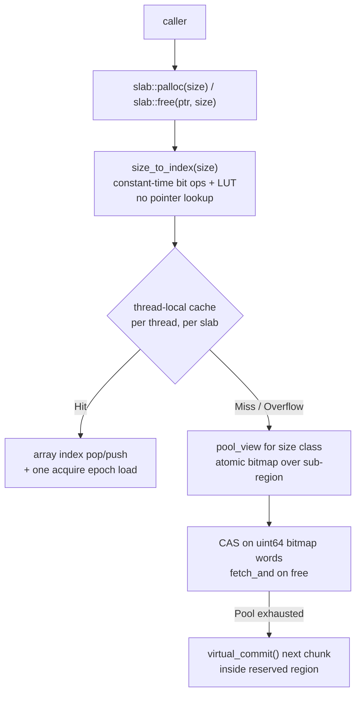

# Palloc

A C++20 memory allocator library built around the insight that the caller usually knows the allocation size. Trading API generality for ~1.5x speedup over jemalloc on small fixed-size workloads.

`C++20` · `CMake` · `Catch2 v3` · `TSan` · `ASan` · `Linux` · `macOS` · `Windows` · `GCC` · `Clang`

---

## Highlights

- **~1.6x faster than jemalloc** on single-threaded alloc+free across 8B-4096B size classes (8.1-8.8 cycles/op vs 12.6-16.2).
- **2.2B ops/s under 12-thread contention** via a lock-free thread-local cache backed by a lock-free atomic-bitmap pool.
- **Mutex-free alloc and free on all non-deprecated paths.** No mutex on alloc or free. TLC hits are array index ops (plus one acquire epoch load); TLC misses fall through to atomic CAS on bitmap words. Pool growth calls the OS to commit pages.
- **Zero data races, zero memory errors** across 128 test cases (238K+ assertions) under both ThreadSanitizer and AddressSanitizer.
- **No system heap dependency** for any non-deprecated allocator. Memory is sourced directly from the OS (`mmap` on Linux/macOS, `VirtualAlloc` on Windows).
- **Single-threaded build mode** (`PALLOC_SINGLE_THREADED`) eliminates every `LOCK`-prefixed instruction by replacing atomics with plain values.

---

## At a Glance

| Allocator | Strategy | Thread Safety | Capacity |
|-----------|----------|---------------|----------|
| `arena<>` | Lock-free bump pointer | Atomic `fetch_add` | Fixed |
| `pool_view` | Non-owning bitmap allocator primitive | Lock-free atomic CAS on alloc, `fetch_and` on free | Determined by owner |
| `pool` | Bitmap allocator (via `pool_view`) | Lock-free atomic CAS on alloc, `fetch_and` on free | Fixed |
| `slab<Config>` / `default_slab` | Multi-pool + thread-local cache | Lock-free TLC, lock-free pool fallback | Grows on demand |

> **Note on `dynamic_slab`**: previously a separate allocator, now `[[deprecated]]`. `slab` was extended to grow on demand and supersedes it. `dynamic_slab` is the only place in the library that holds a mutex.

---

## Quick Example

```cpp
#include <palloc/slab.h>
#include <palloc/arena.h>

int main() {
    // Slab: multi-size-class with thread-local cache.
    AL::default_slab slab;
    auto* order = static_cast<Order*>(slab.palloc(sizeof(Order)));
    new (order) Order{...};
    slab.free(order, sizeof(Order));   // size required: enables O(1) pool routing

    // Arena: linear bump allocator, freed all at once.
    AL::arena<> arena(64 * 1024);
    void* buf = arena.alloc(128);
    arena.reset();   // bulk free
}
```

STL-compatible adapters (`AL::slab_allocator<T>`, `AL::arena_allocator<T>`, `AL::pool_allocator<T>`) are available in `<palloc/allocator.h>` for use with `std::vector`, `std::list`, etc.

### Custom `slab_config`

`default_slab` covers 8B-4096B in 10 power-of-two classes. To tune size classes, block counts, or TLC batch sizes, instantiate `slab_config` directly:

```cpp
#include <palloc/slab_config.h>
#include <palloc/slab.h>

// 3 size classes: 64B, 128B, 256B.
// Constraints: byte_size must be a power of two, strictly increasing,
// batch_size <= num_blocks.
using my_config = AL::slab_config<
    3,                                       // number of size classes
    std::array<AL::size_class, 3>{{
        {.byte_size =  64, .num_blocks = 1024, .batch_size = 64},
        {.byte_size = 128, .num_blocks =  512, .batch_size = 32},
        {.byte_size = 256, .num_blocks =  256, .batch_size = 16},
    }},
    3,               // num_cached_classes: all 3 classes get a TLC
    AL::ONE_GB * 10, // virtual address space reserved at construction
    4                // max slabs cached per thread
>;

AL::slab<my_config> slab;
void* p = slab.palloc(64);
slab.free(p, 64);
```

The config is validated at compile time. Non-power-of-two sizes, out-of-order classes, or `batch_size > num_blocks` are `static_assert` errors.

---

## Architecture



The default config covers 8B-4096B in 10 power-of-two size classes. Each `slab` reserves up to 100GB(configurable) of *virtual* address space at construction, then commits physical pages on demand as pools fill up.

---

## Engineering Decisions

**1. `slab::free(ptr, size)` requires the caller to pass the size.**
This is the biggest API tradeoff in the library. The caller almost always knows the size (it's `sizeof(T)` for typed allocations, or tracked alongside the pointer in containers). Asking for it makes `free` resolve the owning pool via a constant-time bit operation and LUT lookup (`size_to_index`: two `std::bit_width` calls + compile-time table, no pointer provenance lookup). jemalloc's `free(ptr)` must walk a radix tree keyed on address ranges to find the owning arena and size class, which costs 2-3 cache misses on a cold path. This is the primary source of Slab's edge over jemalloc, and the primary reason Slab cannot be a drop-in heap replacement.

**2. Fully lock-free hot path *and* fallback.**
The thread-local cache is the obvious lock-free part: each thread holds up to 128 cached pointers per size class, and alloc/free is a single array index increment/decrement. The less obvious part is that the pool *underneath* the TLC is also lock-free. `pool_view::alloc` and `free_batch` operate on `palloc_atomic<uint64_t>` bitmap words via `compare_exchange_weak`, with a thread-local hint that spreads concurrent threads across different bitmap words to reduce contended CAS. There is no mutex anywhere on the alloc or free path.

**3. Epoch-based TLC invalidation.**
`slab::reset()` is the only operation that needs to invalidate other threads' caches. Instead of stop-the-world synchronization, `reset()` increments an atomic epoch counter; the next TLC access on any thread compares its cached epoch against the current epoch and discards stale entries on mismatch. This keeps the invalidation check off the hot path (one acquire atomic load, predicted not-taken) and never touches other threads directly.

**4. Cache-line aligned pools.**
`class alignas(64) pool` prevents false sharing when `pool` objects are stored in arrays. Note that `slab` internally stores `pool_view` (a non-owning view type), which is not cache-line aligned — bitmap word contention between size classes is instead mitigated by the thread-local hint that steers each thread to a different starting word.

**5. `palloc_atomic<T>` as a compile-time switch.**
Normally `palloc_atomic<T>` aliases `std::atomic<T>`. Under `PALLOC_SINGLE_THREADED`, it becomes a plain value wrapper with the same interface. Every atomic load, store, fetch_add, and compare_exchange in the codebase compiles down to a plain memory access, which removes every `LOCK`-prefixed instruction in the binary. Useful for thread-pinned components like per-core trading engines where the allocator is never shared.

**6. Reserve virtual, commit physical on demand.**
Each slab reserves a large virtual region (no physical pages backing it), then commits pages via `mprotect(PROT_READ | PROT_WRITE)` on Linux (or `VirtualAlloc(MEM_COMMIT)` on Windows) as pools fill up. This avoids paying for physical memory until it's actually used, while keeping every pool's payload in a contiguous range that can be checked with simple pointer-bounds comparison.

---

## Performance

Headline numbers below. Full benchmark suite is in [`docs/BENCHMARKS.md`](docs/BENCHMARKS.md), with perf/flamegraph methodology in [`docs/PROFILING.md`](docs/PROFILING.md).

Measured on Linux, 12-core Intel i5 11th gen, GCC `-O3 -flto`. Lower is better.

### 12-thread contention, cycles/op

| Workload | Slab (TLC) | jemalloc | malloc |
|----------|-----------:|---------:|-------:|
| Single size (32B) | **1.0** | 3.1 | 1.2 |
| Mixed sizes       | 2.5 | 3.2 | **2.3** |
| Batch-hold (500 live objects) | 8.9 | 5.2 | **3.9** |
> Lower is better

Slab leads on single-size contention patterns. Once threads hold more than ~128 live objects simultaneously, the TLC overflows and refills hit contended atomic CAS on the shared pool bitmap, where jemalloc's per-arena design wins.

### Realistic workload: 8-thread order book simulation

56-byte Order objects (allocated from a 64B slab class), random fill/cancel/match.

| Allocator    | ns/op | MOps/s |
|--------------|------:|-------:|
| **Slab (TLC)** | **8.7** | 114.9 |
| malloc       | 9.3   | 107.5  |
| jemalloc     | 10.0  | 100.0  |
| Pool         | 66.9  | 14.9   |
> ns/op lower is better

---

## Limitations

- **Caller must track sizes.** `slab::free(ptr, size)` is the source of the perf advantage. It also means Slab is not a drop-in `malloc` replacement. It fits object pools, per-request buffers, and typed containers, where the size is known statically or carried alongside the pointer.
- **Batch-hold degrades.** Threads holding more than ~128 live objects simultaneously overflow the TLC and start hitting contended atomic CAS on the pool's bitmap words. Lock-free does not mean contention-free: under heavy concurrent batch-hold, jemalloc's per-arena partitioning still wins.
- **`slab::reset()` and `slab::shrink()` are not thread-safe.** They are intended for quiescent-state cleanup, not concurrent operation.

---

## Getting Started

### Requirements

- C++20 compiler (GCC 11+, Clang 13+, MSVC 19.30+)
- CMake 3.10+
- Catch2 v3 (for tests)
- Ninja (recommended)
- jemalloc (optional, for benchmarks)

### Build

```bash
python build.py                          # debug build, runs tests
python build.py --config Release         # release build with LTO
python build.py --stress-test            # release + run stress tests
python build.py --single-threaded        # disables all atomics
python build.py --asan                   # AddressSanitizer
python build.py --tsan                   # ThreadSanitizer
```

ASan and TSan use separate build directories (`build/Debug-asan`, `build/Debug-tsan`) and cannot be combined.

### Tests

Tests run automatically on debug builds. To re-run a subset:

```bash
./build/Debug/tests "[arena]"
./build/Debug/tests "[pool]"
./build/Debug/tests "[slab]"
./build/Debug/tests "[thread]"
```

### Use as a Library

```bash
python build.py --config Release --build-only --install ~/.local
```

Then in your project's `CMakeLists.txt`:

```cmake
find_package(palloc REQUIRED)
target_link_libraries(my_app PRIVATE palloc::palloc)
```

```bash
cmake -B build -DCMAKE_PREFIX_PATH=~/.local
```

---

## Repository Layout

```
include/         public headers
src/             source files
tests/           Catch2 unit tests
stress_tests/    standalone benchmark source files
docs/            benchmarks, profiling notes, and generated artifacts
build.py         primary build entry point (wraps CMake)
```

---

## Author

Built by Altamash Aslam. [LinkedIn]
